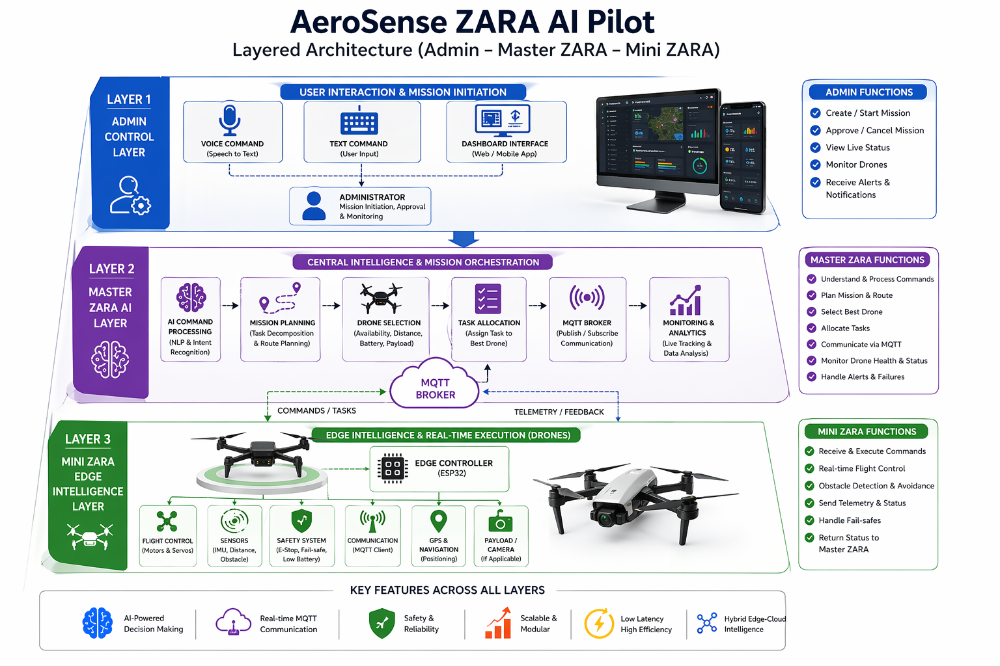
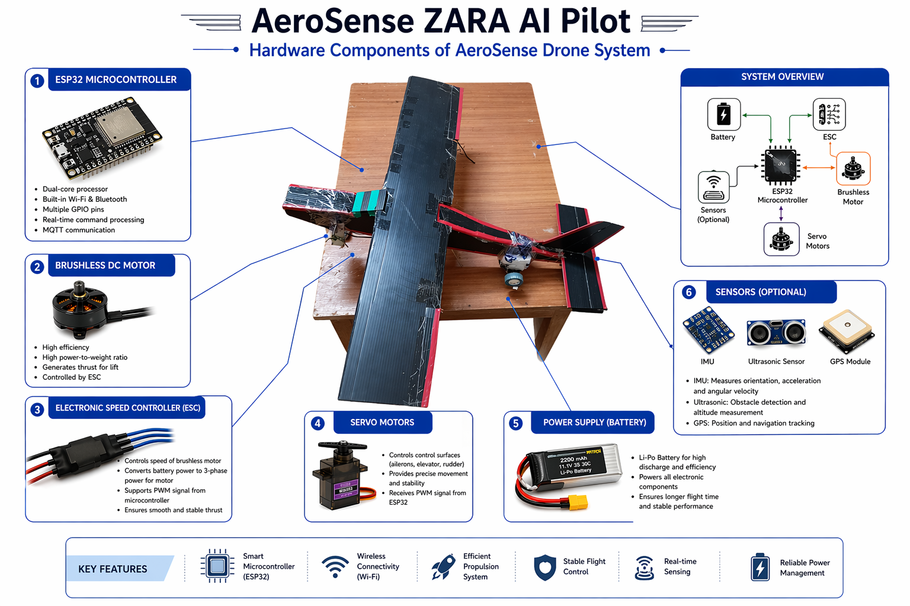
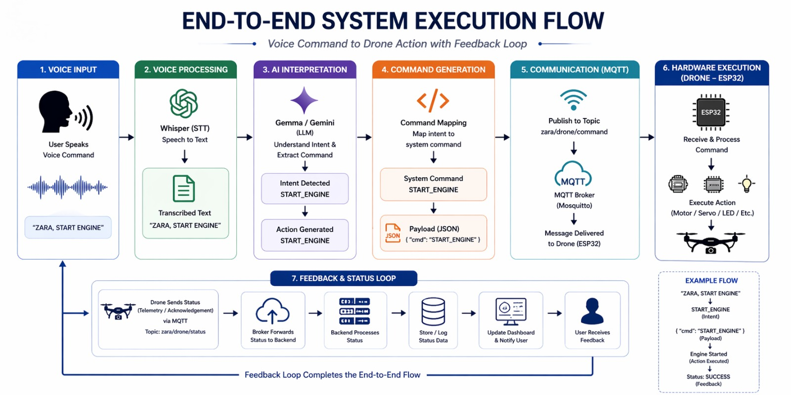
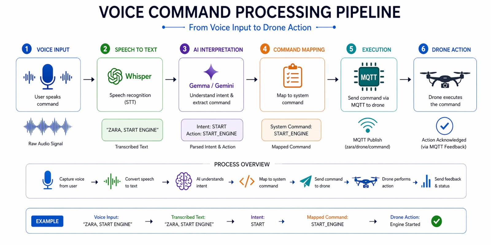
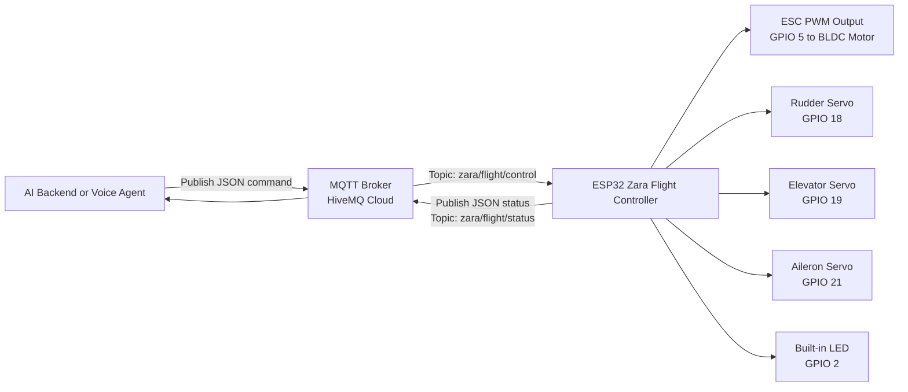
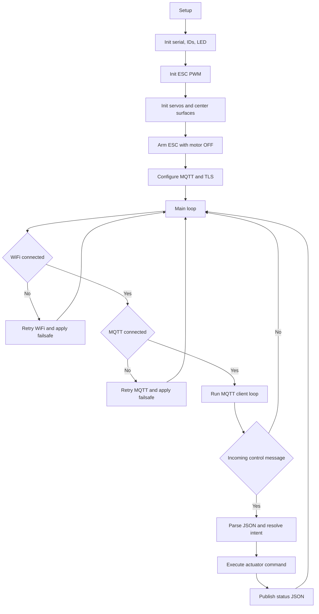
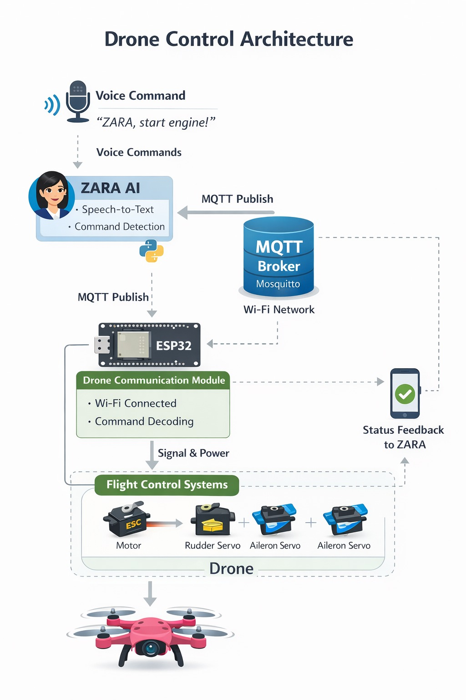
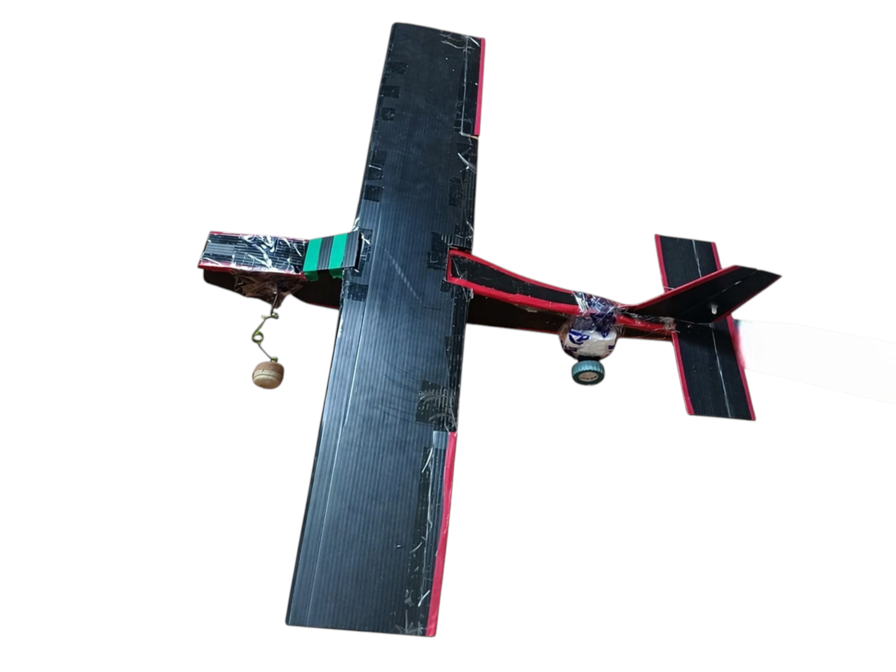

# Zara The AI Autonomous Pilot (ESP32 Flight Controller)


-0A7E3B)


An ESP32-based autonomous flight-control firmware that receives AI or voice-driven commands over MQTT, drives a BLDC motor via ESC, actuates flight control surfaces (rudder, elevator, aileron), and continuously publishes live telemetry/status.





## Table of Contents

1. [What This Project Does](#what-this-project-does)
2. [Complete Working (End-to-End)](#complete-working-end-to-end)
3. [System Architecture](#system-architecture)
4. [Block Diagrams](#block-diagrams)
5. [Hardware and Pin Mapping](#hardware-and-pin-mapping)
6. [Control Interface and Commands](#control-interface-and-commands)
7. [MQTT Data Contract](#mqtt-data-contract)
8. [Safety and Failsafe Logic](#safety-and-failsafe-logic)
9. [Setup and Flashing](#setup-and-flashing)
10. [Validation and Test Commands](#validation-and-test-commands)
11. [Project Structure](#project-structure)
12. [Current Limitations and Improvements](#current-limitations-and-improvements)

## What This Project Does

The firmware in `zara_flight_controller.ino` turns an ESP32 into a networked flight-control endpoint:

- Connects to WiFi in station mode.
- Connects to HiveMQ Cloud over MQTT.
- Supports TLS on port 8883.
- Subscribes to control topic: `zara/flight/control`.
- Parses JSON commands (`action`, `command/text`, `value`).
- Controls:
  - ESC/BLDC motor throttle (PWM pulse in microseconds).
  - Rudder servo (yaw-like directional turn).
  - Elevator servo (pitch up/down).
  - Aileron servo (roll left/right).
  - Built-in LED (basic signaling).
- Publishes live controller status JSON to: `zara/flight/status`.
- Applies automatic failsafe shutdown on connectivity failures.

## Complete Working (End-to-End)





### 1) Boot and Initialization

On power-up, the firmware does the following in order:

1. Starts serial logging at `115200` baud.
2. Builds a unique MQTT client ID from ESP32 efuse MAC.
3. Initializes LED output and sets it OFF.
4. Initializes ESC PWM output on GPIO 5.
5. Initializes and centers all control surface servos.
6. Arms ESC with motor OFF state and wait delay (`ESC_ARM_DELAY_MS = 2500`).
7. Configures TLS/Non-TLS MQTT transport.
8. Starts WiFi connection flow.

### 2) Runtime Loop

The `loop()` continuously:

1. Ensures WiFi is connected (retry every 5s if disconnected).
2. Ensures MQTT is connected (retry every 2s if disconnected).
3. If MQTT is connected, processes incoming packets via `mqttClient.loop()`.
4. If connection drops or processing fails, applies failsafe and reconnect logic.

### 3) Command Processing Path

Incoming JSON from `zara/flight/control`:

1. Parse payload with ArduinoJson.
2. Resolve command intent by:
	- Explicit `action` field, or
	- Natural-language `command` / `text` field (normalized to lowercase and trimmed).
3. Execute mapped control routine.
4. Publish resulting status event to `zara/flight/status`.

## System Architecture

| Layer | Component | Responsibility |
|---|---|---|
| AI/Control | Gemini or command backend | Generates high-level flight commands |
| Messaging | HiveMQ Cloud (MQTT broker) | Reliable pub/sub transport between backend and ESP32 |
| Edge Controller | ESP32 firmware | Interprets JSON commands and drives actuators |
| Actuation | ESC + BLDC + Servos | Physical movement and control response |
| Observability | Status topic + Serial logs | Runtime health, state, and event reporting |

## Block Diagrams

### A) High-Level System Block Diagram



### B) Firmware Control Flow Diagram



### C) Control Surfaces Quick Visual



## Hardware and Pin Mapping



| Function | GPIO | Notes |
|---|---|---|
| ESC / BLDC signal | 5 | PWM 50 Hz, 16-bit resolution |
| Rudder servo | 18 | Direction control (right/left routine) |
| Elevator servo | 19 | Pitch up/down routine |
| Aileron servo | 21 | Roll left/right routine |
| Built-in LED | 2 | Basic indicator (on/off commands) |

### Core Control Constants

| Parameter | Value |
|---|---|
| ESC pulse range | `1000us` to `2000us` |
| ESC stop pulse | `1000us` |
| ESC spin pulse baseline | `1300us` |
| Startup boost pulse | `1450us` for `350ms` |
| ESC arm delay at boot | `2500ms` |
| Servo center angle | `90` |
| Surface hold time | `800ms` before return to center |
| Throttle level range | `0` to `255` |
| Throttle step | `15` |
| Default auto-start throttle | `80` |

## Control Interface and Commands

The controller accepts either:

- Structured action commands (preferred): `{"action":"...","value":...}`
- Natural-language command text: `{"command":"turn right"}` or `{"text":"turn right"}`

### Supported Actions and Text Aliases

| Control Intent | Accepted `action` values | Accepted text commands (`command`/`text`) |
|---|---|---|
| Turn LED on | `led_on`, `turn_on_lights` | `turn on lights`, `turn on light`, `start light` |
| Turn LED off | `led_off`, `turn_off_lights` | `turn off lights`, `turn off light`, `stop light` |
| Engine on | `engine_on`, `turn_on_engine` | `turn on engine`, `start engine`, `engine on`, `turn on motor` |
| Engine off | `engine_off`, `turn_off_engine` | `turn off engine`, `stop engine`, `engine off`, `turn off motor` |
| Throttle up | `throttle_up`, `increase_throttle` | `increase throttle`, `throttle up`, `increase speed` |
| Throttle down | `throttle_down`, `decrease_throttle` | `decrease throttle`, `throttle down`, `decrease speed` |
| Turn right (rudder) | `servo_right`, `turn_right` | `turn right`, `move right`, `servo right` |
| Turn left (rudder) | `servo_left`, `turn_left` | `turn left`, `move left`, `servo left` |
| Elevator up | `elevator_up`, `upward` | `upward`, `move up`, `elevator up`, `pitch up` |
| Elevator down | `elevator_down`, `downward` | `downward`, `move down`, `elevator down`, `pitch down` |
| Roll right | `roll_right`, `right_roll` | `right roll`, `roll right`, `bank right`, `aileron right` |
| Roll left | `roll_left`, `left_roll` | `left roll`, `roll left`, `bank left`, `aileron left` |
| Control check | `control_check` | `control check`, `flight check`, `preflight check`, `system check` |
| Emergency stop | `emergency_stop` | `emergency stop`, `abort`, `kill switch` |

### Value Handling

- For `engine_on`, optional `value` is interpreted as ESC pulse (microseconds), valid in `1000..2000`.
- For throttle commands, optional `value` is interpreted as throttle level, valid in `0..255`.
- If throttle-up/down has no `value`, step size is `15`.

## MQTT Data Contract

### Broker Transport

- Host: `e5c35c674acb4ec6bdb8514fa465cfa6.s1.eu.hivemq.cloud`
- Port: `8883` (TLS)
- Username/password authentication enabled
- Default firmware behavior: TLS enabled, insecure mode used when root CA is empty

### Topics

- Control topic (subscribe): `zara/flight/control`
- Status topic (publish): `zara/flight/status`

### Control Payload Examples

```json
{"action":"engine_on","value":1300}
```

```json
{"action":"throttle_up","value":120}
```

```json
{"command":"turn right"}
```

```json
{"action":"emergency_stop"}
```

### Status Payload Shape

Status is published as JSON with keys:

- `status` (event label)
- `led_on` (boolean)
- `engine_on` (boolean)
- `throttle_level` (0..255)
- `engine_signal_us` (ESC pulse)
- `control_surfaces_ready` (boolean)
- `uptime_ms` (controller uptime)

Example:

```json
{
  "status": "engine_on",
  "led_on": false,
  "engine_on": true,
  "throttle_level": 80,
  "engine_signal_us": 1313,
  "control_surfaces_ready": true,
  "uptime_ms": 12453
}
```

## Safety and Failsafe Logic

The firmware includes multiple automatic safety reactions:

1. On WiFi disconnect:
	- Engine forced OFF.
	- Control surfaces centered.
2. On MQTT disconnect or reconnect failure:
	- Engine forced OFF.
	- Control surfaces centered.
3. On MQTT loop failure:
	- MQTT session reset.
	- Failsafe applied.
4. On explicit emergency stop command:
	- Engine forced OFF.
	- Surfaces centered.
5. On invalid JSON payload:
	- Status `invalid_json` published.

## Setup and Flashing

### Prerequisites

- ESP32 development board
- ESC + BLDC motor setup
- 3 servo outputs connected to control surfaces
- Arduino IDE or PlatformIO
- HiveMQ Cloud MQTT instance

### Arduino IDE Board Setup

1. Install ESP32 board package.
2. Select your ESP32 board and serial port.
3. Install required libraries:
	- `PubSubClient`
	- `ArduinoJson`
	- `ESP32Servo`

### Firmware Configuration

Edit the credentials/constants at the top of `zara_flight_controller.ino`:

- `WIFI_SSID`, `WIFI_PASSWORD`
- `MQTT_HOST`, `MQTT_PORT`, `MQTT_USER`, `MQTT_PASSWORD`
- `TOPIC_CONTROL`, `TOPIC_STATUS`
- `MQTT_ROOT_CA` (recommended for secure TLS verification)

### Upload

1. Build and upload the sketch.
2. Open Serial Monitor at `115200` baud.
3. Confirm logs show:
	- WiFi connected
	- MQTT connected
	- controller online status published

## Validation and Test Commands

Use your preferred MQTT client to publish commands and subscribe to status.

Subscribe:

```bash
mosquitto_sub -h <HOST> -p 8883 -u <USER> -P <PASS> --capath /etc/ssl/certs -t zara/flight/status -v
```

Publish samples:

```bash
mosquitto_pub -h <HOST> -p 8883 -u <USER> -P <PASS> --capath /etc/ssl/certs -t zara/flight/control -m '{"action":"engine_on","value":1300}'
mosquitto_pub -h <HOST> -p 8883 -u <USER> -P <PASS> --capath /etc/ssl/certs -t zara/flight/control -m '{"action":"throttle_up","value":150}'
mosquitto_pub -h <HOST> -p 8883 -u <USER> -P <PASS> --capath /etc/ssl/certs -t zara/flight/control -m '{"command":"turn right"}'
mosquitto_pub -h <HOST> -p 8883 -u <USER> -P <PASS> --capath /etc/ssl/certs -t zara/flight/control -m '{"action":"emergency_stop"}'
```

## Project Structure

```text
.
├── README.md
├── zara_flight_controller.ino
└── images/
  ├── architecture.png
  ├── end-to-end_workflow.png
  ├── voice_pipeline.png
  ├── zara_model_iot_overview.png
  ├── ZARA-model.png
  └── working_test.png
```

## Current Limitations and Improvements

1. Credentials are hardcoded in firmware; move to secure provisioning for production.
2. TLS currently runs in insecure mode if CA certificate is not provided.
3. Surface commands are blocking (`delay` during motion); consider non-blocking state machine.
4. Add watchdog and brownout-aware behavior for flight-critical robustness.
5. Add command authentication/signature on top of MQTT auth for stronger control security.

---

If you want, this README can be extended next with:

- wiring diagram with exact power rails,
- mission-mode command profiles,
- calibration checklist for ESC and servo neutral points,
- and a backend API contract for Gemini integration.
